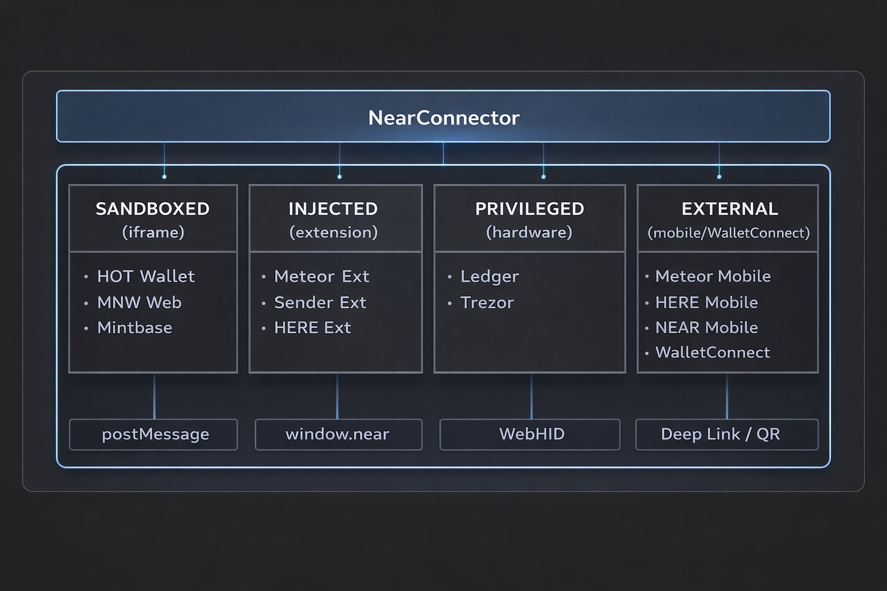

# NearConnect

A comprehensive NEAR Protocol wallet connector library with a four-tier architecture supporting web wallets, browser extensions, hardware wallets, and mobile wallets.

> **Fork Notice:** This is an enhanced fork of [azbang/near-connect](https://github.com/azbang/near-connect) (commit c72689d). See [Enhancements](#enhancements) for details on what's been added.

## Installation

```bash
npm install @shadowcorp/near-connect
# or
yarn add @shadowcorp/near-connect
```

## Four-Tier Wallet Architecture



### Why Four Tiers?

The original NEAR wallet connector relied heavily on iframe sandboxing for security. While sandboxes provide isolation, they have significant limitations:

The four-tier architecture addresses these limitations by treating each wallet type according to its actual trust level and capabilities:

| Tier | Type | Trust Level | Security Model |
|------|------|-------------|----------------|
| 1 | Sandboxed (Web) | Untrusted | Iframe isolation + origin verification |
| 2 | Injected (Extensions) | Semi-trusted | Browser extension sandbox + permission model |
| 3 | Privileged (Hardware) | Trusted | Physical device confirmation required |
| 4 | External (Mobile) | Verified | Cryptographic signatures + callback verification |

This architecture, combined with the security layers below, provides defense-in-depth rather than relying on any single security mechanism.

## Quick Start

```typescript
import { NearConnector } from "@shadowcorp/near-connect";

const connector = new NearConnector({
  network: "mainnet",
  // Optional: hardware wallet config
  hardware: {
    ledger: { enabled: true }
  },
  // Optional: WalletConnect for mobile
  external: {
    walletConnect: { projectId: "your-project-id" }
  }
});

// Listen for events
connector.on("wallet:signIn", async ({ accounts }) => {
  console.log("Connected:", accounts[0].accountId);
});

connector.on("wallet:signOut", () => {
  console.log("Disconnected");
});

// Get available wallets
const wallets = connector.getWallets();

// Connect to a wallet
await connector.connect("ledger");

// Sign and send transaction
const result = await connector.signAndSendTransaction({
  receiverId: "example.near",
  actions: [{ type: "Transfer", params: { deposit: "1000000000000000000000000" } }]
});
```

## Hardware Wallet Support (Ledger)

```typescript
import { LedgerWallet, createLedgerWallet } from "@shadowcorp/near-connect";

// Using the factory function
const ledger = createLedgerWallet({
  network: "mainnet",
  rpcUrl: "https://rpc.mainnet.near.org"
});

// Listen for hardware events
ledger.on("waiting", ({ action }) => {
  console.log(`Please ${action} on your Ledger device...`);
});

ledger.on("confirm", ({ action }) => {
  console.log(`Action confirmed: ${action}`);
});

// Connect and get accounts
await ledger.connect();
const accounts = ledger.getAccounts();

// Sign transaction
const result = await ledger.signAndSendTransaction({
  receiverId: "example.near",
  actions: [{ type: "Transfer", params: { deposit: "1000000000000000000000000" } }]
});
```

## Mobile Wallet Support

```typescript
import { ExternalWalletManager } from "@shadowcorp/near-connect";

const external = new ExternalWalletManager({
  network: "mainnet",
  appName: "My dApp",
  appUrl: "https://mydapp.com",
  callbackUrl: "https://mydapp.com/callback"
});

// Connect via deep link (Meteor, HERE wallet)
await external.connect("meteor-mobile");

// Or via WalletConnect
await external.connect("walletconnect");
```

## Pre-built UI Components

```typescript
import {
  WalletSelectorModal,
  TransactionModal,
  AccountSwitcherModal,
  darkTheme,
  lightTheme
} from "@shadowcorp/near-connect";

// Wallet selection modal
const selectorModal = new WalletSelectorModal({
  wallets: connector.getWallets(),
  theme: darkTheme,
  onSelect: async (walletId) => {
    await connector.connect(walletId);
  }
});

selectorModal.open();

// Transaction confirmation modal
const txModal = new TransactionModal({
  transaction: { receiverId: "example.near", actions: [...] },
  theme: darkTheme,
  onConfirm: async () => {
    await connector.signAndSendTransaction(tx);
  }
});
```

## Session Persistence

```typescript
import {
  SessionManager,
  LocalStorage,
  EncryptedStorage
} from "@shadowcorp/near-connect";

// Basic persistence
const session = new SessionManager({
  storage: new LocalStorage(),
  key: "near-session"
});

// Encrypted persistence
const secureSession = new SessionManager({
  storage: new EncryptedStorage("your-encryption-key"),
  key: "near-session",
  expiresIn: 24 * 60 * 60 * 1000 // 24 hours
});
```

## Connection Reliability

```typescript
import {
  withRetry,
  CircuitBreaker,
  HealthMonitor,
  ConnectionStateMachine
} from "@shadowcorp/near-connect";

// Retry with exponential backoff
const result = await withRetry(
  () => connector.signAndSendTransaction(tx),
  { maxRetries: 3, baseDelay: 1000 }
);

// Circuit breaker for failing connections
const breaker = new CircuitBreaker({
  failureThreshold: 5,
  resetTimeout: 30000
});

// Health monitoring
const health = new HealthMonitor({
  checkInterval: 10000,
  healthCheck: () => connector.isConnected()
});

health.on("unhealthy", () => {
  console.log("Connection lost, attempting reconnect...");
});
```

## Transaction Simulation

```typescript
import { TransactionSimulator, quickGasEstimate } from "@shadowcorp/near-connect";

// Quick gas estimate
const gas = await quickGasEstimate(transaction, "mainnet");

// Full simulation
const simulator = new TransactionSimulator({ network: "mainnet" });
const result = await simulator.simulate(transaction);

if (result.warnings.length > 0) {
  console.log("Warnings:", result.warnings);
}
```

## Trust Scoring

```typescript
import { TrustScorer, quickTrustCheck } from "@shadowcorp/near-connect";

// Quick trust check
const trust = await quickTrustCheck("meteor-wallet");
console.log(`Trust level: ${trust.level}`); // "high", "medium", "low", "unknown"

// Detailed scoring
const scorer = new TrustScorer();
const score = await scorer.score("meteor-wallet");
console.log(`Score: ${score.overall}/100`);
console.log(`Signals:`, score.signals);
console.log(`Warnings:`, score.warnings);
```

## Analytics

```typescript
import {
  Analytics,
  ConsoleAnalyticsAdapter,
  BatchingAnalyticsAdapter
} from "@shadowcorp/near-connect";

const analytics = new Analytics({
  adapter: new BatchingAnalyticsAdapter({
    batchSize: 10,
    flushInterval: 5000,
    onFlush: (events) => {
      // Send to your analytics service
      fetch("/api/analytics", { method: "POST", body: JSON.stringify(events) });
    }
  })
});

// Track events
analytics.track("wallet:connect", { walletId: "ledger" });
analytics.track("transaction:send", { amount: "1 NEAR" });
```

## Security Layers

Since sandboxing alone isn't sufficient, NearConnect implements multiple security layers that work together to protect users:

### Transaction Guard

Analyzes transactions before signing to detect dangerous operations:

```typescript
import { TransactionGuard, createDefaultTransactionGuard } from "@shadowcorp/near-connect";

const guard = createDefaultTransactionGuard();

// Analyze transaction risk
const risk = guard.analyzeRisk({
  receiverId: "contract.near",
  actions: [{ type: "FunctionCall", params: { methodName: "transfer", args: {} } }]
});

console.log(risk.level);    // "low" | "medium" | "high" | "critical"
console.log(risk.reasons);  // ["Large transfer: 500.00 NEAR"]

// Validate before signing
const result = guard.validate(transaction);
if (!result.valid) {
  console.log("Blocked:", result.error);
}
```

**What it detects:**
- Dangerous methods (`add_full_access_key`, `delete_account`, `deploy_contract`)
- Large transfers (configurable threshold, default 100 NEAR)
- Known scam contracts
- Delete account actions
- Contract deployments
- Custom blocklists and allowlists

### Origin Guard

Validates message origins to prevent cross-site attacks:

```typescript
import { OriginGuard, createSecureMessageHandler } from "@shadowcorp/near-connect";

const guard = new OriginGuard({
  appOrigins: ["https://myapp.com"],
  walletOrigins: {
    "custom-wallet": ["https://custom.wallet"]
  }
});

// Check if origin is trusted
guard.isOriginTrusted("https://wallet.meteorwallet.app"); // true
guard.isOriginTrusted("https://evil.com"); // false

// Validate callback URLs
const result = guard.verifyCallbackUrl("https://myapp.com/callback");
if (!result.valid) {
  console.log("Invalid callback:", result.reason);
}

// Secure postMessage handler
const handler = createSecureMessageHandler({
  trustedOrigins: ["https://wallet.meteorwallet.app"],
  onMessage: (data, origin) => {
    // Only called for verified origins
  }
});
window.addEventListener("message", handler);
```

### Rate Limiter

Prevents abuse by limiting request frequency:

```typescript
import { RateLimiter, connectLimiter, signLimiter } from "@shadowcorp/near-connect";

// Custom limiter
const limiter = new RateLimiter({
  maxRequests: 10,      // Max requests per window
  windowMs: 60000,      // 1 minute window
  blockDurationMs: 300000  // Block for 5 minutes if exceeded
});

const result = limiter.check("user-action");
if (!result.allowed) {
  console.log(`Rate limited. Retry in ${result.retryAfter}s`);
}

// Pre-configured limiters
connectLimiter.check("wallet-connect");  // 5 per minute
signLimiter.check("sign-tx");            // 10 per minute
```

### Audit Log

Tracks all wallet actions for investigation and compliance:

```typescript
import { AuditLog, createAuditLog } from "@shadowcorp/near-connect";

const auditLog = createAuditLog({
  consoleLog: true,           // Log security events to console
  remoteEndpoint: "/api/audit", // Optional: send to server
  persist: true               // Persist to localStorage
});

// Log events
auditLog.log("wallet:connect", { walletId: "ledger", accountId: "alice.near" });
auditLog.log("tx:sign", { data: { receiverId: "bob.near" } });
auditLog.logSecurityWarning("Large transfer detected", { amount: "500 NEAR" });

// Query events
const securityEvents = auditLog.getSecurityEvents();
const recentTx = auditLog.getEvents({ type: ["tx:sign", "tx:broadcast"], limit: 10 });

// Export for analysis
const json = auditLog.export();
const csv = auditLog.exportCsv();
```

**Event types tracked:**
- `wallet:connect`, `wallet:disconnect`, `wallet:switch`
- `tx:sign`, `tx:broadcast`, `tx:blocked`, `tx:failed`
- `security:violation`, `security:warning`
- `rate:limited`
- `hardware:connect`, `hardware:disconnect`, `hardware:error`

### Secure Storage

AES-GCM encrypted localStorage for sensitive data:

```typescript
import { SecureStorage, createSecureStorage } from "@shadowcorp/near-connect";

// Create encrypted storage (browser only)
const storage = await createSecureStorage({
  keyName: "my-app-key"  // Stored in non-exportable CryptoKey
});

// Store sensitive data
await storage.set("session", JSON.stringify({ token: "..." }));
const data = await storage.get("session");
```

### Content Security Policy

Helpers for configuring CSP headers:

```typescript
import {
  generateCSP,
  getRecommendedCSP,
  runSecurityChecklist
} from "@shadowcorp/near-connect";

// Generate CSP header
const csp = generateCSP({
  "default-src": ["'self'"],
  "connect-src": ["'self'", "https://rpc.mainnet.near.org"],
  "frame-src": ["https://wallet.meteorwallet.app"]
});

// Get recommended CSP for NEAR apps
const recommended = getRecommendedCSP();

// Run security checklist
const checks = runSecurityChecklist();
checks.forEach(check => {
  console.log(`${check.passed ? "✓" : "✗"} ${check.name}: ${check.message}`);
});
```

### Using Security Layers Together

```typescript
import {
  createDefaultTransactionGuard,
  createAuditLog,
  RateLimiter
} from "@shadowcorp/near-connect";

// Setup security stack
const txGuard = createDefaultTransactionGuard();
const auditLog = createAuditLog({ consoleLog: true });
const rateLimiter = new RateLimiter({ maxRequests: 10, windowMs: 60000 });

async function secureSign(transaction) {
  // 1. Check rate limit
  const rateResult = rateLimiter.check("sign");
  if (!rateResult.allowed) {
    auditLog.log("rate:limited", { data: { retryAfter: rateResult.retryAfter } });
    throw new Error(`Rate limited. Retry in ${rateResult.retryAfter}s`);
  }

  // 2. Validate transaction
  const txResult = txGuard.validate(transaction);
  if (!txResult.valid) {
    auditLog.logTransaction("tx:blocked", {
      receiverId: transaction.receiverId,
      error: txResult.error,
      risk: txResult.risk.level
    });
    throw new Error(txResult.error);
  }

  // 3. Log and proceed
  auditLog.logTransaction("tx:sign", { receiverId: transaction.receiverId });
  return await wallet.signAndSendTransaction(transaction);
}
```

## Enhancements

This fork adds the following features to the original near-connect:

### Session & Storage
- Multiple storage backends (Memory, Local, Session, IndexedDB, Encrypted)
- SessionManager with validation and automatic expiry

### Error Handling
- Structured error system with typed error codes
- Specific error classes for different failure modes
- User-friendly messages and recovery suggestions

### UI Components
- WalletSelectorModal, TransactionModal, AccountSwitcherModal
- Dark/light theme system with CSS variable generation
- Customizable icons and styling

### Connection Reliability
- Retry logic with exponential backoff
- Connection state machine
- Health monitoring
- Automatic reconnection
- Circuit breaker pattern

### Hardware Wallets (Tier 3: Privileged)
- WebHID transport for Ledger
- APDU protocol implementation
- Full borsh serialization for NEAR transactions
- NEP-413 message signing

### Mobile Wallets (Tier 4: External)
- Deep link support (Meteor, HERE)
- WalletConnect v2 integration
- Redirect flow handling
- Mobile device detection

### Security Layers
- **TransactionGuard** - Risk analysis, dangerous method detection, blocklists
- **OriginGuard** - postMessage origin validation, callback URL verification
- **SecureStorage** - AES-GCM encrypted localStorage
- **RateLimiter** - Request throttling with configurable windows and blocking
- **AuditLog** - Event tracking, security monitoring, JSON/CSV export
- **CSP Helpers** - Content Security Policy generation and security checklist

### Other
- Transaction simulation with gas estimation
- Federated wallet manifest system
- Trust scoring for wallet reputation
- Pluggable analytics system
- Multi-account support

## API Reference

See the [TypeScript definitions](./src/index.ts) for full API documentation.

## License

MIT

## Credits

Original library by [azbang](https://github.com/azbang/near-connect).
Enhanced by ShadowCorp.
